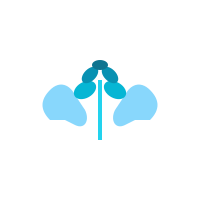

# 🌱 Rafola - Mental Health Support Platform

> **Healing Together** - A comprehensive mental health support platform connecting individuals through safe communities, peer support, and professional resources.



## 🎯 Overview

Rafola is a modern, full-stack mental health platform designed specifically for South African users. It provides a safe space for individuals to connect, share experiences, and access mental health resources while maintaining privacy and anonymity options.

## ✨ Key Features

### 🤝 **Community Support**
- **Support Groups**: Join topic-specific communities (grief, anxiety, depression, recovery, trauma)
- **Buddy System**: 1-on-1 peer connections with matching algorithm
- **Anonymous Mode**: Complete privacy protection for sensitive sharing
- **Moderated Environment**: Safe, supervised discussions

### 💬 **Communication Tools**
- **Real-time Messaging**: Instant chat with buddies and group members
- **Video Sessions**: Secure video support groups and 1-on-1 sessions
- **Crisis Support**: Immediate access to SA crisis hotlines and resources
- **Notifications**: Stay connected with your support network

### 📚 **Resources & Tools**
- **Resource Library**: Curated mental health guides and articles
- **Crisis Resources**: SA-specific emergency contacts and helplines
- **Personal Journal**: Private space for reflection and progress tracking
- **Progress Tracking**: Monitor your healing journey

### 🛡️ **Privacy & Security**
- **End-to-end Encryption**: Secure communications
- **Anonymous Options**: Join communities without revealing identity
- **Data Protection**: POPIA-compliant data handling
- **Confidentiality**: 100% private and secure platform

## 🏗️ Technical Architecture

### **Frontend**
- **Framework**: Next.js 14 with App Router
- **Styling**: Tailwind CSS with custom Rafola theme
- **UI Components**: Custom components with premium design
- **State Management**: Zustand for client-side state
- **Real-time**: Socket.io client for live features
- **Authentication**: JWT-based auth with secure storage

### **Backend**
- **Runtime**: Node.js with Express.js
- **Database**: PostgreSQL with Prisma ORM
- **Authentication**: JWT tokens with bcrypt hashing
- **Real-time**: Socket.io server for live communications
- **File Storage**: Local storage with cloud-ready architecture
- **API**: RESTful API with comprehensive endpoints

### **Database Schema**
```sql
Users → Groups (Many-to-Many via GroupMembers)
Users → Messages (One-to-Many)
Users → BuddyRequests (One-to-Many)
Groups → Posts (One-to-Many)
Posts → Comments (One-to-Many)
Resources (Standalone)
```

## 🚀 Quick Start

### Prerequisites
- Node.js 18+ and npm
- PostgreSQL database
- Git

### Installation

1. **Clone the repository**
```bash
git clone <repository-url>
cd rafola
```

2. **Install dependencies**
```bash
# Frontend dependencies
npm install

# Backend dependencies
cd backend
npm install
cd ..
```

3. **Environment Setup**
```bash
# Copy environment files
cp .env.local.example .env.local
cp backend/.env.example backend/.env

# Configure your environment variables
# - Database connection string
# - JWT secret
# - Frontend/Backend URLs
```

4. **Database Setup**
```bash
cd backend
npx prisma generate
npx prisma db push
npx prisma db seed  # Optional: seed with sample data
cd ..
```

5. **Start Development Servers**
```bash
# Terminal 1: Backend server
cd backend
npm run dev

# Terminal 2: Frontend server
npm run dev
```

6. **Access the Application**
- Frontend: http://localhost:3000
- Backend API: http://localhost:3001
- Admin Panel: http://localhost:3000/admin

## 📱 User Journey

### **Registration & Onboarding**
1. **Account Creation**: Multi-step registration with healing preferences
2. **Profile Setup**: Choose anonymity level and healing topics
3. **Plan Selection**: Free, Supporter (R300/mo), or Premium (R450/mo)
4. **Community Matching**: Algorithm suggests relevant support groups

### **Daily Usage**
1. **Dashboard**: Personalized overview of communities and connections
2. **Community Participation**: Join discussions, share experiences
3. **Buddy Connections**: 1-on-1 support relationships
4. **Resource Access**: Browse curated mental health content
5. **Crisis Support**: Immediate access to help when needed

### **Growth & Healing**
1. **Progress Tracking**: Monitor healing journey milestones
2. **Skill Building**: Access to coping strategies and tools
3. **Peer Support**: Give and receive support from community
4. **Professional Resources**: Connect with mental health professionals

## 🎨 Design System

### **Rafola Brand Colors**
- **Primary**: Teal (#0d9488) - Growth and healing
- **Secondary**: Emerald (#059669) - Nature and renewal  
- **Accent**: Green (#16a34a) - Hope and vitality
- **Supporting**: Cyan, Rose, Gray scales

### **Typography**
- **Headings**: Bold, clear hierarchy
- **Body**: Readable, accessible font sizes
- **UI Elements**: Consistent spacing and sizing

### **Components**
- **Cards**: Rounded corners, subtle shadows, hover effects
- **Buttons**: Gradient backgrounds, smooth transitions
- **Forms**: Clean inputs with focus states
- **Navigation**: Fixed navbar with scroll effects

## 🔐 Security Features

### **Data Protection**
- **Encryption**: All sensitive data encrypted at rest and in transit
- **Authentication**: Secure JWT implementation with refresh tokens
- **Authorization**: Role-based access control (User, Admin, Moderator)
- **Input Validation**: Comprehensive server-side validation
- **Rate Limiting**: API protection against abuse

### **Privacy Controls**
- **Anonymous Mode**: Complete identity protection
- **Data Minimization**: Collect only necessary information
- **User Control**: Full control over data sharing and visibility
- **Deletion Rights**: Complete account and data removal options

## 🌍 South African Integration

### **Crisis Support Resources**
- **Suicide Crisis Line**: 0800 567 567
- **SADAG**: South African Depression and Anxiety Group
- **Lifeline**: 0861 322 322
- **Local Resources**: Province-specific mental health services

### **Cultural Considerations**
- **Multi-language Support**: English with plans for local languages
- **Cultural Sensitivity**: Respectful of diverse SA communities
- **Local Partnerships**: Integration with SA mental health organizations
- **Affordable Pricing**: ZAR pricing accessible to local users

## 👥 User Roles & Permissions

### **Regular Users**
- Join communities and connect with buddies
- Access resources and participate in discussions
- Use crisis support features
- Manage privacy settings

### **Moderators**
- Monitor community discussions
- Enforce community guidelines
- Support users in crisis situations
- Report issues to administrators

### **Administrators**
- Full platform management
- User and content moderation
- Analytics and reporting
- System configuration and maintenance

## 📊 Admin Dashboard Features

### **User Management**
- User registration and activity monitoring
- Account status management (active, suspended)
- Support ticket handling
- User analytics and insights

### **Content Management**
- Community creation and moderation
- Resource library management
- Crisis resource updates
- Content approval workflows

### **Analytics & Reporting**
- User engagement metrics
- Community health indicators
- Crisis intervention tracking
- Platform usage statistics

## 🔧 API Documentation

### **Authentication Endpoints**
```
POST /api/auth/register - User registration
POST /api/auth/login - User login
POST /api/auth/forgot-password - Password reset request
POST /api/auth/reset-password - Password reset confirmation
```

### **User Management**
```
GET /api/users/me - Get current user profile
PATCH /api/users/me - Update user profile
GET /api/users/:id - Get user by ID (limited info)
```

### **Communities & Groups**
```
GET /api/groups - List all groups
POST /api/groups - Create new group
GET /api/groups/:id - Get group details
POST /api/groups/:id/join - Join group
GET /api/groups/:id/posts - Get group posts
POST /api/groups/:id/posts - Create group post
```

### **Messaging System**
```
GET /api/messages/conversations - Get user conversations
GET /api/messages/:userId - Get messages with specific user
POST /api/messages - Send new message
```

### **Resources**
```
GET /api/resources - Get all resources
GET /api/resources?category=:category - Filter by category
POST /api/resources - Create resource (admin)
```

## 🚀 Deployment

### **Production Environment**
- **Frontend**: Vercel or Netlify deployment
- **Backend**: Railway, Heroku, or VPS deployment
- **Database**: PostgreSQL on cloud provider
- **File Storage**: AWS S3 or similar cloud storage
- **Monitoring**: Error tracking and performance monitoring

### **Environment Variables**
```bash
# Frontend (.env.local)
NEXT_PUBLIC_API_URL=https://api.rafola.com
NEXT_PUBLIC_SOCKET_URL=https://api.rafola.com

# Backend (.env)
DATABASE_URL=postgresql://...
JWT_SECRET=your-secret-key
FRONTEND_URL=https://rafola.com
PORT=3001
```

## 🧪 Testing

### **Frontend Testing**
```bash
npm run test          # Run unit tests
npm run test:e2e      # Run end-to-end tests
npm run test:coverage # Generate coverage report
```

### **Backend Testing**
```bash
cd backend
npm run test          # Run API tests
npm run test:db       # Run database tests
```

## 📈 Roadmap

### **Phase 1: Core Platform** ✅
- User registration and authentication
- Basic communities and messaging
- Resource library
- Admin dashboard

### **Phase 2: Enhanced Features** 🚧
- Video calling integration
- Advanced matching algorithms
- Mobile app development
- Professional therapist integration

### **Phase 3: Scale & Expand** 📋
- Multi-language support
- AI-powered insights
- Integration with healthcare providers
- Advanced analytics and reporting

## 🤝 Contributing

We welcome contributions from the community! Please read our contributing guidelines:

1. **Fork the repository**
2. **Create a feature branch**: `git checkout -b feature/amazing-feature`
3. **Commit changes**: `git commit -m 'Add amazing feature'`
4. **Push to branch**: `git push origin feature/amazing-feature`
5. **Open a Pull Request**

### **Development Guidelines**
- Follow TypeScript best practices
- Write comprehensive tests
- Maintain code documentation
- Follow the established code style
- Ensure accessibility compliance

## 📄 License

This project is licensed under the MIT License - see the [LICENSE](LICENSE) file for details.

## 🆘 Support & Crisis Resources

### **Immediate Help**
If you or someone you know is in crisis, please contact:
- **Emergency Services**: 10111 or 112
- **Suicide Crisis Line**: 0800 567 567
- **SADAG**: 0800 70 80 90
- **Lifeline**: 0861 322 322

### **Platform Support**
- **Email**: support@rafola.com
- **Documentation**: [docs.rafola.com](https://docs.rafola.com)
- **Community**: [community.rafola.com](https://community.rafola.com)

## 🙏 Acknowledgments

- **Mental Health Professionals**: For guidance on best practices
- **South African Mental Health Organizations**: For local insights
- **Open Source Community**: For the amazing tools and libraries
- **Beta Testers**: For valuable feedback and testing

---

**Built with 💚 for mental wellness in South Africa**

*Rafola - Where healing happens together* 🌱